```{r}
setwd("C:/Users/mlzam/OneDrive/Documents/repos/chile1988")
```


## Background

Authoritarians occassionally do semi-competitive elections

Bureaucrats are relatively easier voters to coerce

There is little evidence that secret ballots are violated (Hicken and Nathan 2022)

We might think bureaucrats will not risk their jobs by voting against their employer

## Theory 

I argue, whether bureaucrats vote against their employer depends on: 
<br>
1. Risk of facing negative outcomes, based on rank and political salience of the agency\
2. Risk tolerance (Kam 2012)

Negative outcomes: authoritarian retaliation, loss of power and wealth after democratization, being prosecuted during transitional justice trials

## Risk of negative outcomes

<div style="display: flex; justify-content: center; align-items: center; height: 40%;">
|  | High Political Salience | Low Political Salience |
|:---:|:---:|:---:|
| **High-rank** | Highest risk | Lower risk |
| **Low-rank** | Lower risk | Lowest risk |
</div>

## Motivation

Whether bureaucrats vote for authoritarians or not matters because authoritarians use semi-competitive elections to legitimize their governments 

If even the employees of the state do not support authoritarians, we can have hope for the restoration of democracy 


## Hypotheses

1. Alternative incentives:
State employment, even under authoritarianism, does not guarantee support for the incumbent

2. Rank-based heterogeneous effects:
Higher-rank bureaucrats are more likely to vote for the incumbent than lower-rank bureaucrats 
   - Higher benefits, higher risk

## Context 

In 1988, there was a plebiscite in Chile asking whether citizens wanted the continuation of the dictatorship or not 

YES $\rightarrow$  Vote in favor of Pinochet staying\
NO $\rightarrow$  Vote to change leaders, democratization 

## Context 

With nearly 56%, Pinochet lost and Chile has been a democracy ever since

::: {style="text-align: center;"}
{width=90%}
:::


## Data 

1. 1992 census data\
The census asks municipality of residence in 1987, one year before the plebiscite. It also asks occupation, years of school, and education type. I created municipality-level proportions*

2. 1988 municipality-level voting records\
Municipality-level voting data from the National Electoral Service (SERVEL), as well municipality-level control variables from Bautista el al. (2021) 

## Analysis 

Controls: Logged distance to regional capital, share of left-wing votes in the latest democratic election (1970), population, share of victims across time relative to 1970 population

I am using OLS regressions with:

- Weights by municipality population
- Province fixed effects
- CR2 standard errors 


## First specification: Bureaucrats

$$ Y_m = \alpha + \beta \text{(Prop. Bureaucrat)}_m + X_m + \lambda_p + \varepsilon_m$$ 

Tests _alternative incentives_: State employment, even under authoritarianism, does not guarantee electoral support for the incumbent 

Expectation: The population of bureaucrats in the municipality should have no effect in the dictatorship’s voteshare 

## Second specification 

::: {style="text-align: center; font-size: 0.85em;"}
$$Y_m = \alpha + \beta_1(\text{Share High Rank B.})_m + \beta_2(\text{Share Mid Rank B.})_m + X_m + \lambda_p + \varepsilon_m$$
:::

Rank variables based on years of schooling:\
   - High-rank: College or more\
   - Mid-rank: High school or more\
   - Low-rank: Did not start high school

## Second specification 

::: {style="text-align: center; font-size: 0.85em;"}
$$Y_m = \alpha + \beta_1(\text{Share High Rank B.})_m + \beta_2(\text{Share Mid Rank B.})_m + X_m + \lambda_p + \varepsilon_m$$
:::

Tests _heterogeneous effects_: Higher-rank bureaucrats are more likely to vote for the incumbent than lower-rank bureaucrats 

Expectation: The high-rank coefficient should be negative, less support for opposition 

## Identification 

Relies on conditional ignorability:\

I assume that conditional on my controls, the _proportion of bureaucrats_ among the municipality population and the _rank-composition of the bureaucracy_ is as if random

I assume no unmeasured confounding (difficult)\
- I do sensitivity tests at the end 

## Results of both hypotheses 

::: {style="text-align: center;"}
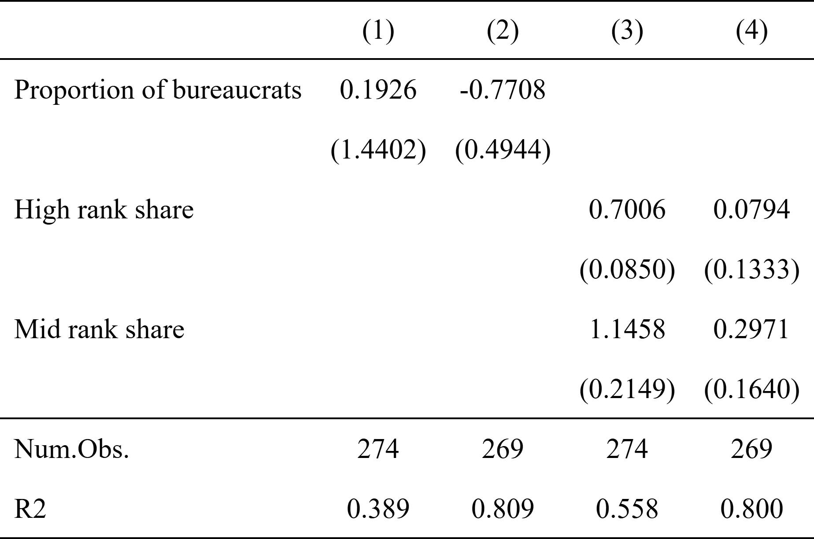{width=70%}
:::

## Results: Alternative incentives 

::: {style="text-align: center;"}
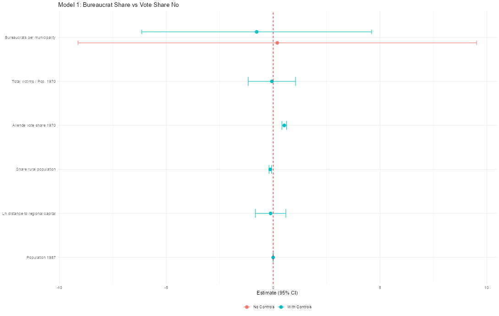{width=70%}
:::

## Results: Alternative incentives 

::: {style="text-align: center;"}
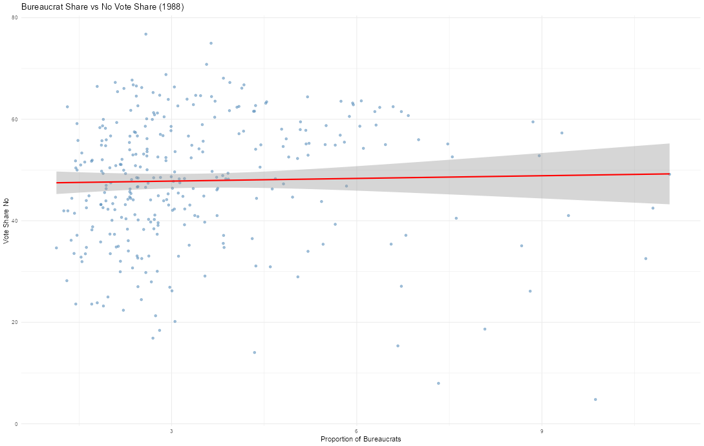{width=70%}
:::


## Results: Rank-based heterogeneous effects

::: {style="text-align: center;"}
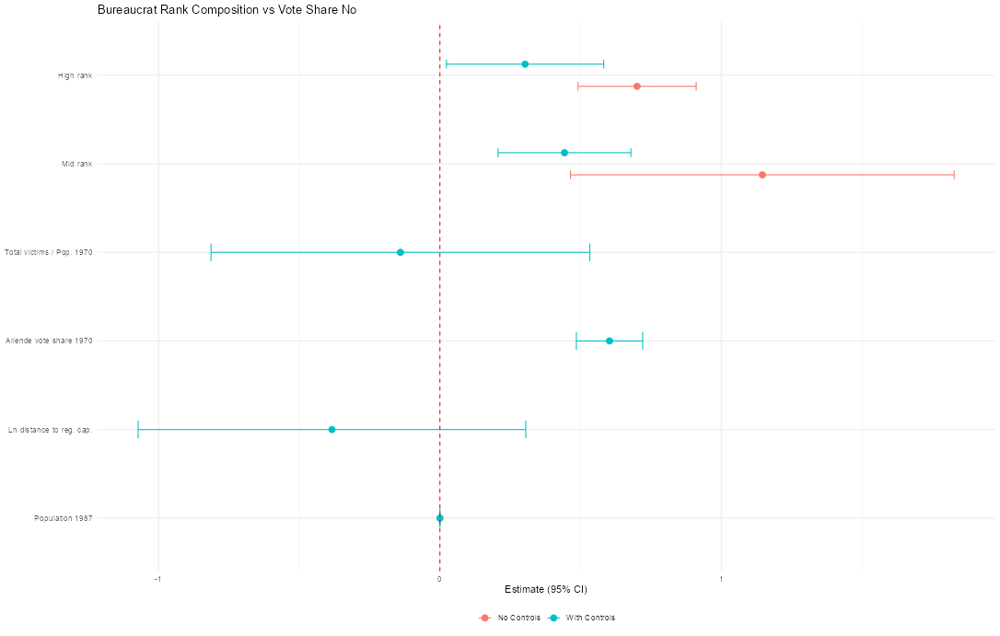{width=70%}
:::

## Heterogenous effects, other specification 

::: {style="text-align: center;"}
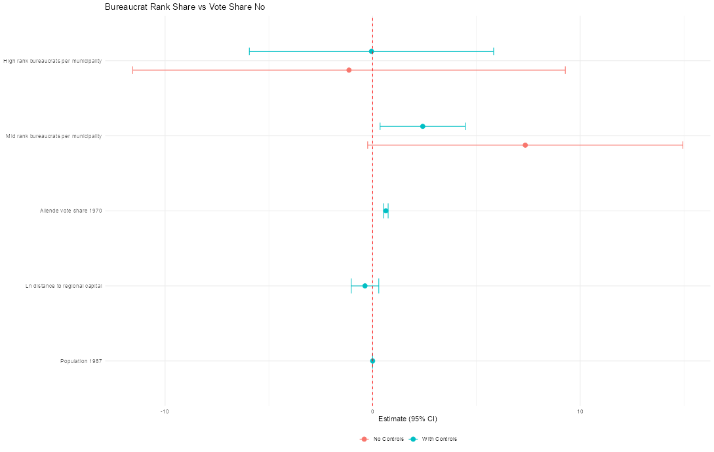{width=70%}
:::

## Plotting education and vote share NO  

::: {style="text-align: center;"}
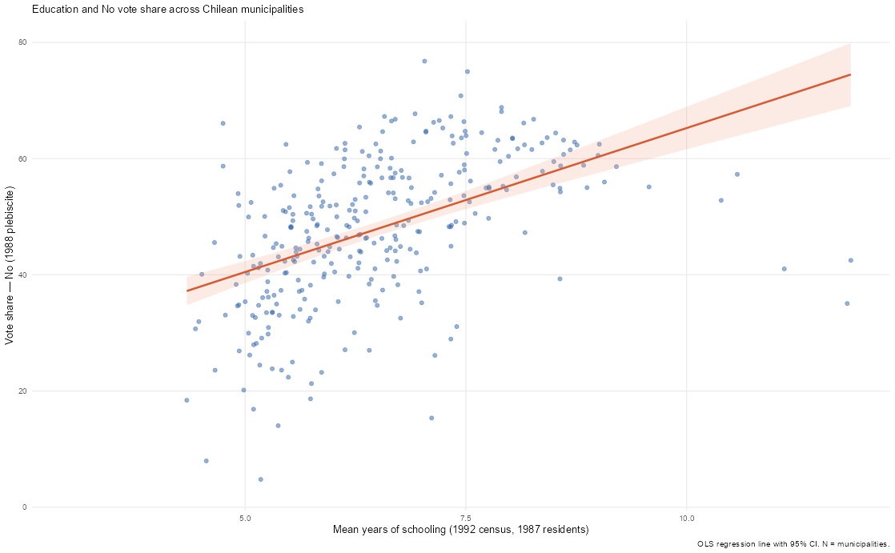{width=70%}
:::


## Sensitivity test: Rank-based effects

First specification

| Model | Estimate | SE | Partial R² (D) | RV (sig.) | RV (zero) |
|:------|:---:|:---:|:---:|:---:|:---:|
| High-rank bureaucrats | 0.3028 | 0.0765 | 0.0615 | 0.1204 | 0.2253 |
| Mid-rank bureaucrats | 0.4427 | 0.0972 | 0.0799 | 0.1536 | 0.2544 |

::: {.aside}
 (Cinelli & Hazlett 2020) RV = robustness value. Partial R²(D): partial R² of the treatment after controls. RV(sig.): confounding needed to eliminate significance at 5%. RV(zero): confounding needed to drive estimate to zero. Models include province fixed effects, weighted by 1987 population.
:::


## Sensitivity test: High-rank bureaucrats

::: {style="text-align: center;"}
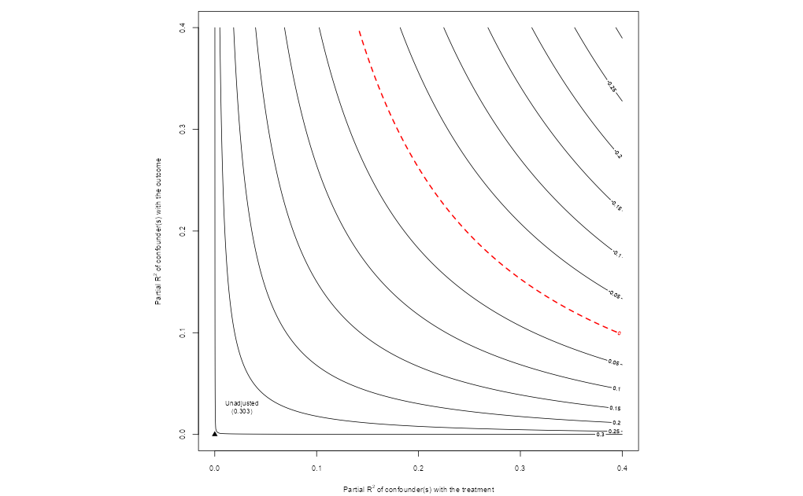{width=70%}
:::

##  Sensitivity test: Mid rank bureaucrats

| Model | Estimate | SE | Partial R² (D) | RV (sig.) | RV (zero) |
|:------|:---:|:---:|:---:|:---:|:---:|
| Share among bureaucrats | 0.4427 | 0.0972 | 0.0799 | 0.1536 | 0.2544 |
| Share of total population | 2.4130 | 0.7616 | 0.0401 | 0.0742 | 0.1847 |

::: {.aside}
 (Cinelli & Hazlett 2020) RV = robustness value. Partial R²(D): partial R² of the treatment after controls. RV(sig.): confounding needed to eliminate significance at 5%. RV(zero): confounding needed to drive estimate to zero. Models include province fixed effects, weighted by 1987 population.
:::

## Sensitivity tests: Mid-rank bureaucrats


:::: {.columns}

::: {.column width="50%"}
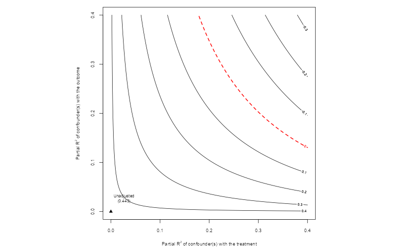{width=100% fig-align="center"}

::: {style="text-align: center; font-size: 0.8em;"}
Share among bureaucrats
:::
:::

::: {.column width="50%"}
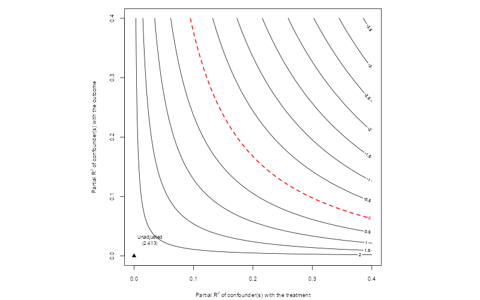{width=100% fig-align="center"}

::: {style="text-align: center; font-size: 0.8em;"}
Share of total population
:::
:::

::::

## Problems 

1. Some of my covariates are post-plebiscite 
   - Location data is pre-plebiscite, but occupation data is post-plecisbite 
   - It's unclear which bureaucrats worked for both governments 
   - Major issue; I need new data
2. It's hard to disentangle mechanisms for the difference between ranks\
3. Bad proxy: The correlation between voting behavior and education is the opposite from the expected one


## Questions/feedback

1. What other unmeasured confounders can you think of? 
2. What do you think of the hypotheses? Do they seem to pan out in the cases you’re familiar with? 
3. Are there any ways to improve my paper with the data limitations I have today? 

## What I would like to do next

Pinochet’s bureaucrats are still alive; I want to ask them who they voted for 

To do so → Randomized response technique 

The respondent throws a dice and is instructed: answer “yes” if the dice rolls 1, “no” if the dice rolls 6, the truth if the dice rolls 2, 3, or 4 

The problems are sampling and social desirability bias


## Thanks! 

## Extras

## Summary statistics

::: {style="text-align: center;"}
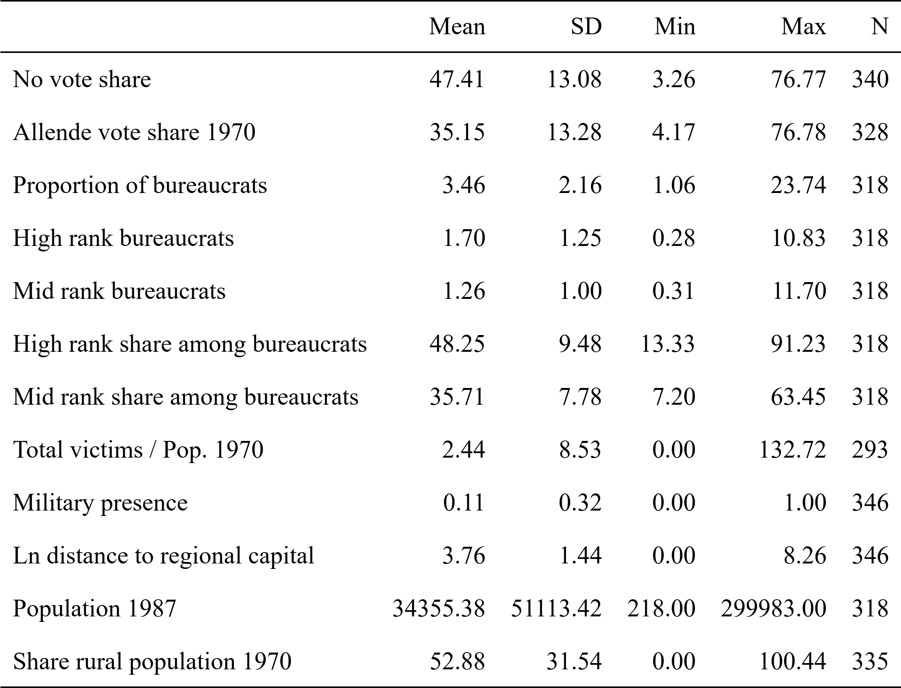{width=50%}
:::

## Bureaucrat rank share by municipality

::: {style="text-align: center;"}
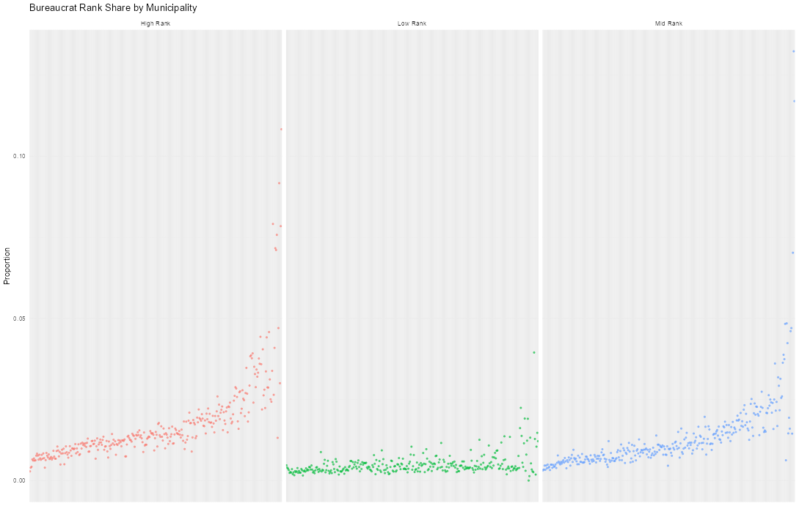{width=70%}
:::

## Distribution of years of schooling

::: {style="text-align: center;"}
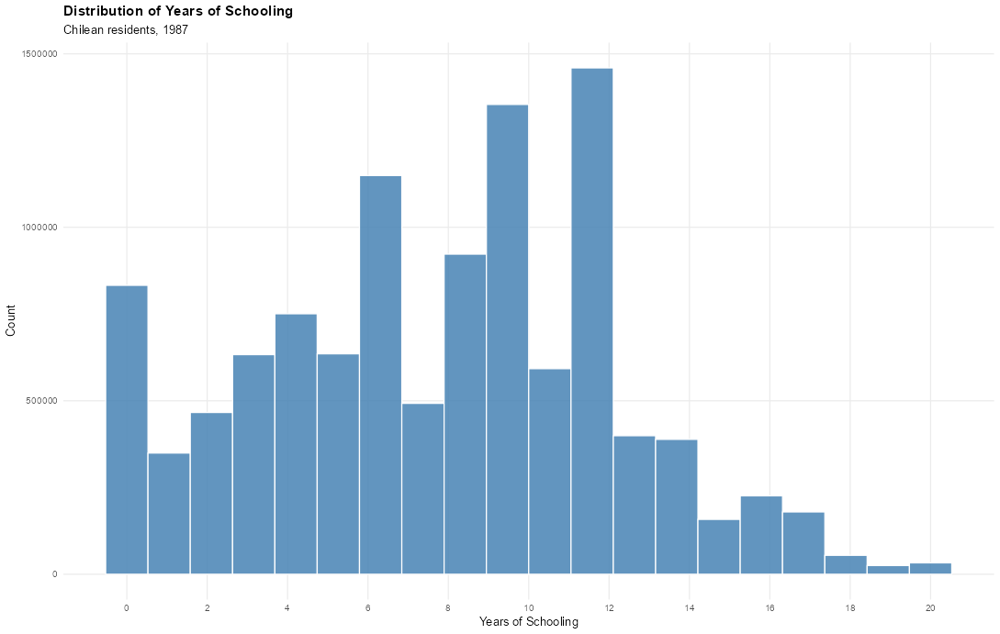{width=70%}
:::

## Distribution of bureaucrat share by education level

::: {style="text-align: center;"}
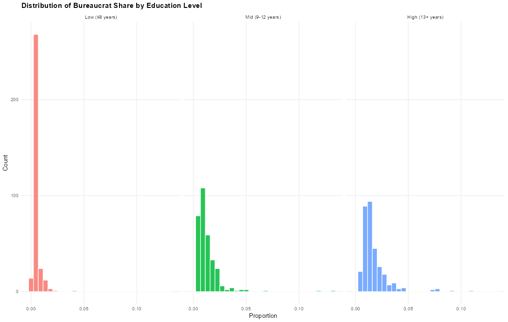{width=70%}
:::


