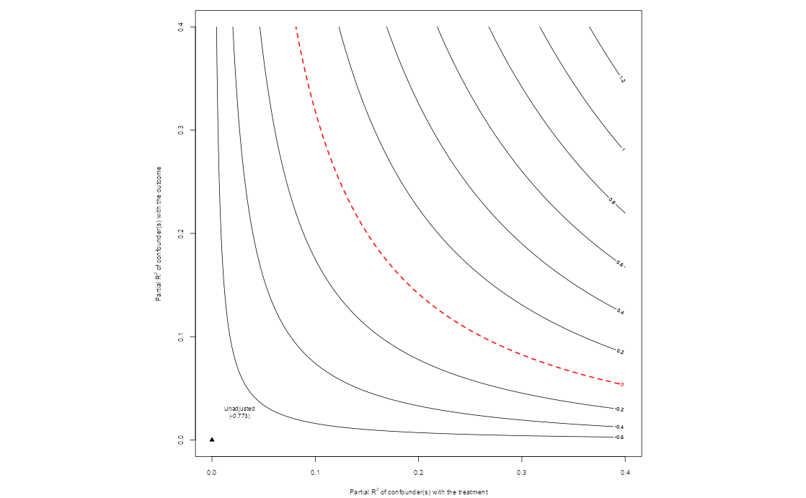

```{r}
setwd("C:/Users/mlzam/OneDrive/Documents/repos/chile1988")
```


## Research question 

Authoritarians occassionally do elections, some of these are competitive 
Bureaucrats are relatively easier voters to coerce

We might think bureaucrats will not risk their jobs by voting against their employer. However, bureaucrats may: 

1. Genuinely not like the government they work for
2. Believe they will keep their job after a transition
2. See the impacts of authoritarianism in their personal lifes; voting is relational

There is little evidence that secret ballots are violated ()

## Motivation

Whether bureaucrats vote for authoritarians or not matters because (old) evidence suggests that bureaucrats have higher turnout rates

Therefore, bureaucrats can shape close elections, and become an important support for democratic outcomes 

## Hypotheses

1. Alternative incentives:
State employment does not guarantee support for the incumbent, even under authoritarianism 

2. Rank-based heterogeneous effects:
Higher-rank bureaucrats are more likely to vote for the incumbent than lower-rank bureaucrats
   - They have more to lose after a transition 

## Context 

In 1988, there was a plebiscite in Chile asking whether citizens wanted the continuation of the dictatorship or not 

YES - Vote in favor of Pinochet staying\
NO - Vote to change leaders $\rightarrow$ democratization 

With nearly 56%, Pinochet lost and Chile has been a democracy ever since

::: {style="text-align: center;"}
{width=70%}
:::

## Data 

1. 1992 census data\
The census asks municipality of residence in 1987, one year before the plebiscite. It also asks occupation, years of school, and education type.\
I created municipality-level proportions

2. 1988 municipality-level voting records\
Municipality-level voting data from the National Electoral Service (SERVEL), as well municipality-level control variables from Bautista el al. (2021) 

## Analysis 

I am using OLS regressions with:

- Weights by municipality population
- Province fixed effects
- CR2 standard errors 

Controls: Logged distance to regional capital, share of left-wing votes in the latest democratic election (1970), population, share of victims across time relative to 1970 population

## First specification: Bureaucrats

$$ Y_m = \alpha + \beta \text{(Prop. Bureaucrat)}_m + X_m + \lambda_p + \varepsilon_m$$ 

Tests _alternative incentives_: State employment does not guarantee electoral support for the regime 

Expectation: The population of bureaucrats in the municipality should have no effect in the dictatorship’s voteshare 

## Second specification 

::: {style="text-align: center; font-size: 0.85em;"}
$$Y_m = \alpha + \beta_1(\text{Share High Rank B.})_m + \beta_2(\text{Share Mid Rank B.})_m + X_m + \lambda_p + \varepsilon_m$$
:::

Rank variables based on years of schooling:\
   - High-rank: College or more\
   - Mid-rank: High school or more\
   - Low-rank: Did not start high school

Tests _heterogeneous effects_ $\rightarrow$ Higher-rank bureaucrats are more likely to vote for the incumbent than lower-rank bureaucrats

Expectation: The high-rank coefficient should be positive

## Identification 

Relies on conditional ignorability:\
I assume that conditional on my controls, the _proportion of bureaucrats_ among the municipality population and _the rank-composition of the bureaucracy_ is as if random

I assume no unmeasured confounding (difficult)\
- I do sensitivity tests at the end 

## Results of both hypotheses 

::: {style="text-align: center;"}
{width=70%}
:::

## Results: Alternative incentives 

::: {style="text-align: center;"}
{width=70%}
:::

## Results: Alternative incentives 

::: {style="text-align: center;"}
{width=70%}
:::


## Results: Rank-based heterogeneous effects

::: {style="text-align: center;"}
{width=70%}
:::

## Sensitivity tests: Alternative incentives 

::: {style="text-align: center;"}
{width=70%}
:::

## Sensitivity tests: Rank-based heterogeneous effects

::: {style="text-align: center;"}
{width=70%}
:::


## Problems 

1. Some of my covariates are post-plebiscite 
2. It's hard to disentangle mechanisms for the difference between ranks. E.g. Higher-rank bureaucrats not only have more to lose, they also have more information
3. I want to incorporate more behavior literature: risk, sensation seeking

## Questions/feedback

1. What other unmeasured confounders can you think of? 
2. I really care about the relational side of voting. How do I measure that?
3. What do you think of the hypotheses? Do the mechanisms make sense? 
Do they seem to pan out in the cases you’re familiar with? 
4. What do you think scope conditions are? What do you think of perception of competition as a scope condition? How to measure that? 
5. Are there any ways to improve my paper you can think of with the data limitations I have today? 

## What I would like to do next

Pinochet’s bureaucrats are still alive; I want to ask them who they voted for 

To do so → Randomized response technique 

The respondent throws a dice and is instructed: answer “yes” if the dice rolls 1, “no” if the dice rolls 6, the truth if the dice rolls 2, 3, or 4 

Probabilistically I would be able to subtract the proportion of the responses that come from 2, 3, of 4 and uncover real answers 

The problems are sampling and social desirability bias


## Thanks! 

## Extras

## Balance table 

::: {style="text-align: center;"}
{width=70%}
:::

## Heterogenous effects, other specification 

::: {style="text-align: center;"}
{width=70%}
:::

##

::: {style="text-align: center;"}
{width=70%}
:::

##

::: {style="text-align: center;"}
{width=70%}
:::

##

::: {style="text-align: center;"}
{width=70%}
:::


